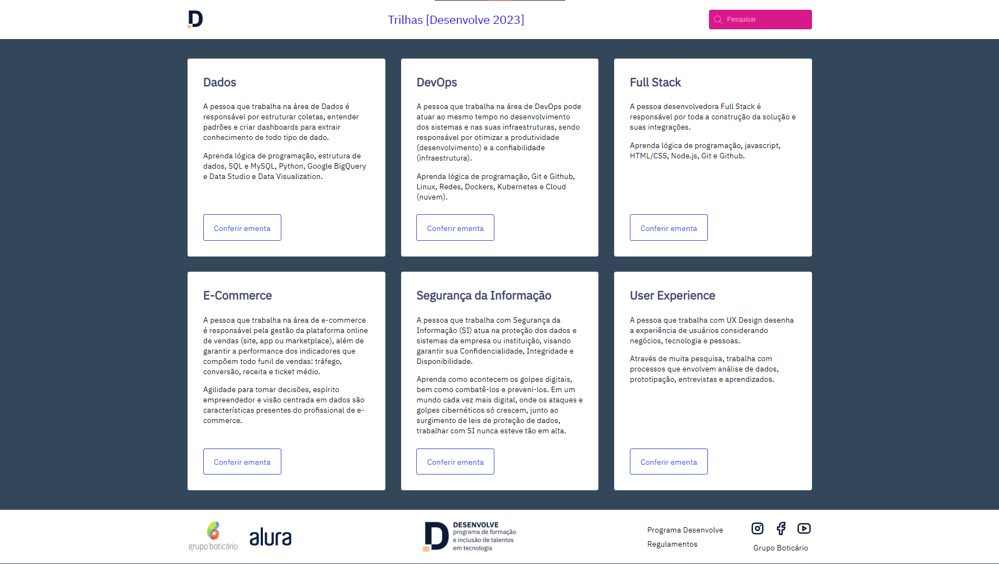

# Desafio Desenvolve 01 - Landing Page Trilhas Desenvolve

O programa desenvolve do grupo boticário nos apresentou o desafio inicial de criar um site, o qual consistia em uma landing page contendo header, main e footer. Onde na section main deveria haver um grid relacionado às trilhas oferecidas pelo programa.

## 🚀 Demonstração

[Clique aqui](linkaqui) para acessar o resultado final do projeto.

## 🛠️ Tecnologias Utilizadas

* [HTML](https://developer.mozilla.org/pt-BR/docs/Web/HTML) - Linguagem de Marcação
* [CSS](https://developer.mozilla.org/pt-BR/docs/Web/CSS) - Linguagem de Estilização

## 👨‍💻 Desenvolvedor

    
    
&nbsp&nbsp&nbspFlávio Mattos 
    &nbsp&nbsp&nbsp<a href="https://www.instagram.com/fflaviomattos/">Instagram</a>&nbsp;|&nbsp;<a href="https://github.com/FlavioMattosDev">GitHub</a>&nbsp;|&nbsp;<a href="https://www.linkedin.com/in/flavio-mattos/">LinkedIn</a>&nbsp;

  

---
